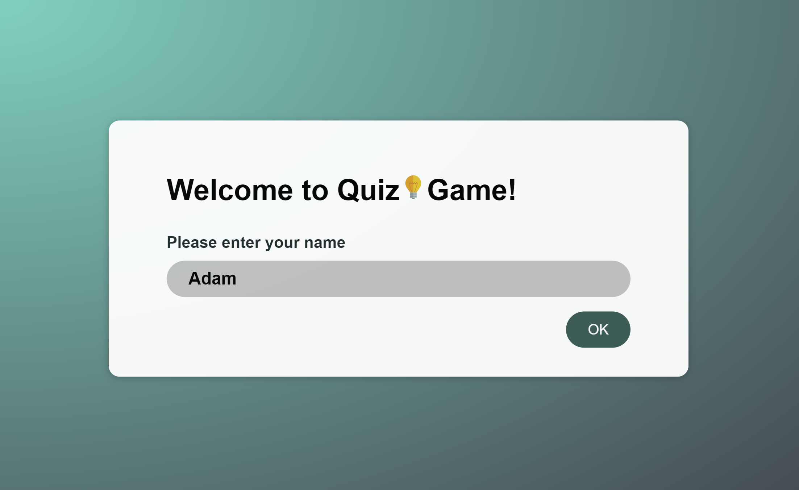
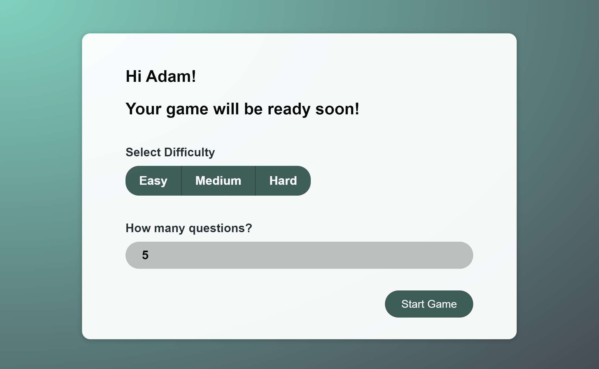
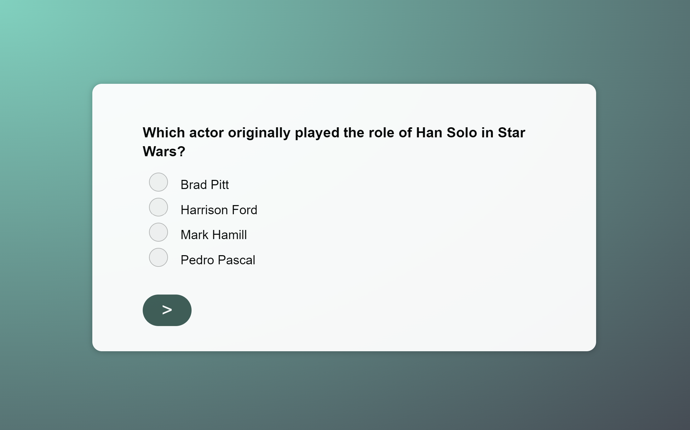
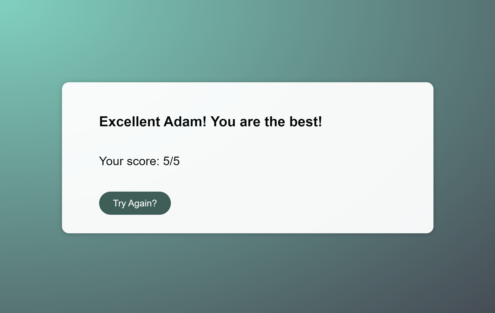

# 💡Quiz Game

## Try me
#### [myawesomequizgame.netlify.app](https://myawesomequizgame.netlify.app/)

## About
It's a fun quiz game allowing you to test your general knoledge. Each game has quick setup with adjustable difficulty level and number of questions. All servered in simple and pleasant UI. Quiz questions across a range of categories are taken from [The Trivia API](https://the-trivia-api.com/).
 
## Features
- Mobile accessbility
- Responsive web design
- Quick setup
- Configurable difficulty level
- Customizable amount of questions
- Every question has four answers with only one which is correct
- Final score on quiz completion
- Game shows summary based on your score

## Tech
- React
- Vite
- Redux
- CSS module
- Sass

## How to run
Quiz Game requires ViteJS to run; 
1. Clone repository
2. Use ``npm run dev`` to run it locally

## Screens
 
 
 
 

## License
MIT
